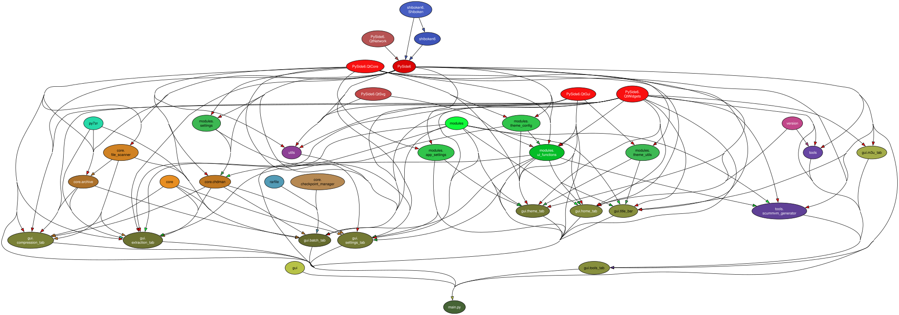
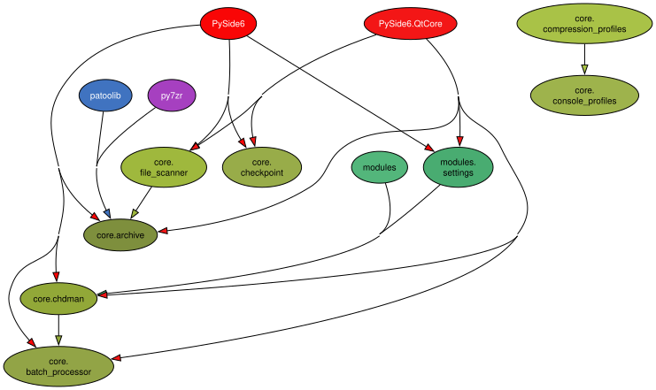
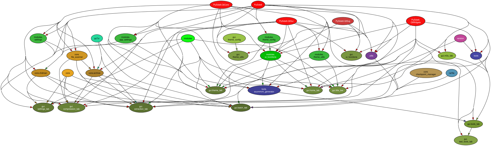
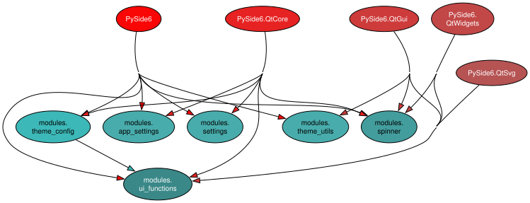
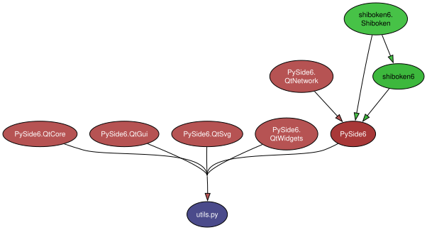
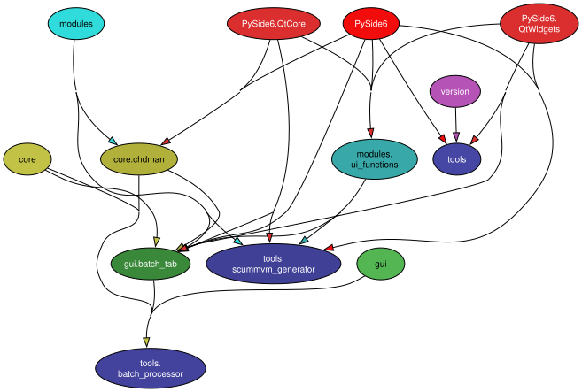
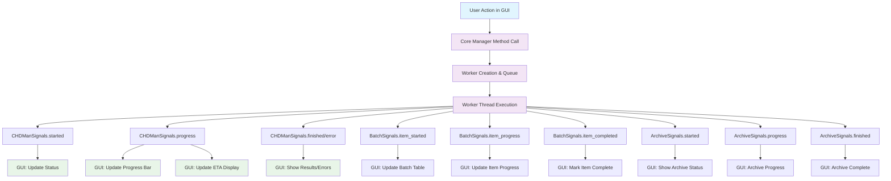
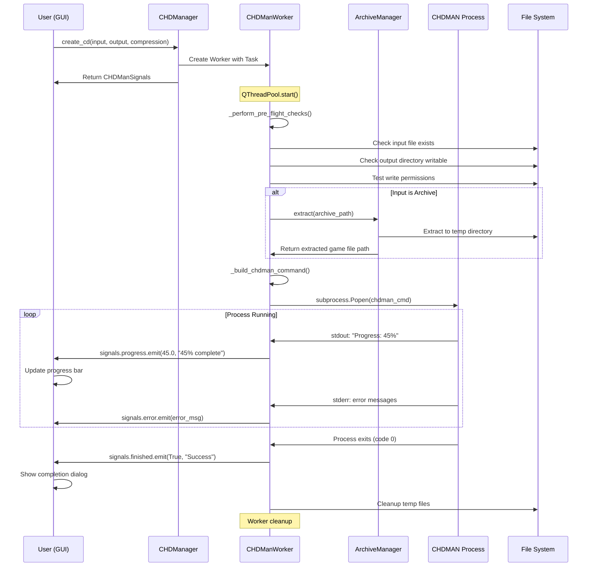
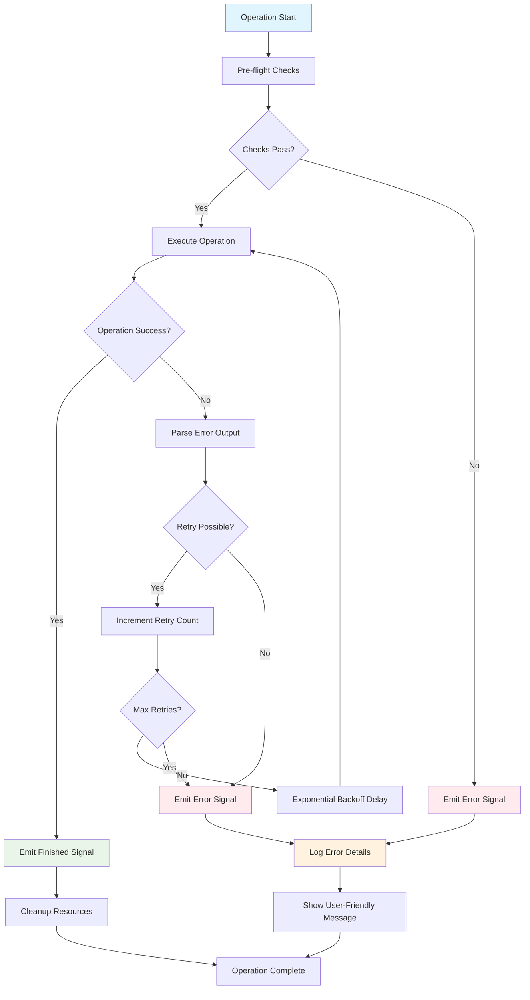

# RetroClamp Application Architecture

This document provides a comprehensive overview of the RetroClamp application's architecture, its main components, design patterns, threading model, and their interactions.

## Table of Contents

- [High-Level Overview](#high-level-overview)
- [Core Architecture Patterns](#core-architecture-patterns)
- [Threading and Concurrency Model](#threading-and-concurrency-model)
- [Signal/Slot Communication System](#signalslot-communication-system)
- [Core Components (Module & Package Breakdown)](#core-components-module--package-breakdown)
  - [1. Main Entry Point (`main.py`)](#1-main-entry-point-mainpy)
  - [2. Core Logic (`core` package)](#2-core-logic-core-package)
    - [CHDMan/CHDManWorker System Details](#chdmanchdmanworker-system-details)
    - [Advanced Batch Processing Details](#advanced-batch-processing-details)
    - [Console-Specific Intelligence](#console-specific-intelligence)
    - [Robust Archive Integration](#robust-archive-integration)
  - [3. Graphical User Interface (`gui` package)](#3-graphical-user-interface-gui-package)
  - [4. Supporting Modules (`modules` package)](#4-supporting-modules-modules-package)
  - [5. Utilities (`utils.py`)](#5-utilities-utilspy)
  - [6. Tools (`tools` package)](#6-tools-tools-package)
- [Error Handling Strategy](#error-handling-strategy)
- [State Management and Persistence](#state-management-and-persistence)
- [Performance Optimizations](#performance-optimizations)
- [Extensibility Points](#extensibility-points)
- [Key Libraries](#key-libraries)
- [Data Flow](#data-flow)
- [Visual Architecture Diagrams](#visual-architecture-diagrams)
- [Performance Characteristics](#performance-characteristics)
- [Recovery Mechanisms](#recovery-mechanisms)
- [Security Model](#security-model)
- [Quick Troubleshooting Guide](#quick-troubleshooting-guide)
- [Example: Connecting to CHD Operation Signals](#example-connecting-to-chd-operation-signals)

---

## High-Level Overview

RetroClamp is a sophisticated desktop application built with Python and PySide6 (Qt6) that provides a comprehensive interface for CHDMAN operations. The application excels in:

- **Parallel CHD Processing**: Multiple concurrent operations with real-time progress tracking.
- **Advanced Archive Handling**: Seamless integration of archive extraction with CHD operations.
- **Intelligent Batch Processing**: Resume-capable batch operations with checkpoint management.
- **Console-Specific Optimization**: Tailored compression profiles for different gaming systems.
  The application follows a modular design, separating core processing logic, user interface components, and supporting utilities.

## Core Architecture Patterns

### 1. Worker-Manager Pattern

```
CHDManager → CHDManWorker (QRunnable)
ArchiveManager → ArchiveWorker (QRunnable)
BatchProcessor → BatchWorker (QRunnable)
```

### 2. Signal-Driven Communication

- Asynchronous operation reporting through Qt signals

- Decoupled UI updates from background processing

- Progress tracking with ETA calculations

  ### 3. Singleton Pattern with Thread Safety

  ```python
  # CHDManager singleton with proper locking
  _chd_manager_singleton = None
  _singleton_lock = threading.Lock()
  ```

## Threading and Concurrency Model

### Multi-Level Threading Architecture

#### Level 1: QThreadPool Management

- **CHDMan**: Manages CHD operation workers

- **ArchiveManager**: Handles archive extraction/compression

- **BatchProcessor**: Coordinates batch operations

- **FileScanner**: Performs directory scanning

  #### Level 2: Process Execution

  ```python
  # Dual execution paths in CHDManWorker
  def _execute_and_monitor_process(self, cmd: List[str]):
    # subprocess.Popen for detailed monitoring
  def _execute_with_qprocess(self, cmd: List[str]):
    # QProcess for Qt-integrated execution
  ```

  #### Level 3: Stream Monitoring

  ```python
  # Real-time stdout/stderr monitoring
  stdout_thread = threading.Thread(target=read_stream_local)
  stderr_thread = threading.Thread(target=read_stream_local)
  ```

  ### Concurrency Features

- **Worker Deduplication**: Prevents duplicate operations on same files

- **Graceful Cancellation**: Proper cleanup of running processes

- **Resource Management**: Automatic worker cleanup on completion

- **Thread-Safe Progress Tracking**: Mutex-protected state updates

## Signal/Slot Communication System

### Hierarchical Signal Architecture

#### CHDManSignals (Core Operations)

```python
started = Signal(str)                    # Operation start
progress = Signal(float, str)            # Real-time progress
finished = Signal(bool, str)             # Operation completion
error = Signal(str)                      # Error reporting
progress_updated = Signal(float, str, str)  # Enhanced progress (percent, message, worker_id)
task_completed = Signal(str, bool, str)  # Task-level completion
```

#### BatchSignals (Batch Operations)

```python
# Batch-level coordination
started, finished, paused, resumed, cancelled = ...
progress_updated = Signal(int, int, object)  # Progress with ETA

# Item-level tracking
item_started, item_progress, item_completed = ...
item_failed, item_skipped, item_updated = ...
```

#### ArchiveSignals (Archive Operations)

```python
started = Signal(str)
progress = Signal(float, str)
finished = Signal(bool, str, str)        # Success, message, output_path
error = Signal(str)
```

### Advanced Signal Features

- **ETA Calculation**: Real-time time remaining estimates
- **Progress Aggregation**: Batch-level progress from individual items
- **Error Propagation**: Detailed error context through signal chains
- **State Change Notifications**: Automatic UI synchronization

## Core Components (Module & Package Breakdown)

Below is a description of the main modules and packages within the RetroClamp application, incorporating details on their specific architectural implementations.

### 1. Main Entry Point (`main.py`)

- **Role:** Initializes the application, sets up the main window, and orchestrates the interaction between different components.

- **Key Responsibilities:**

  - Application startup and shutdown.
  - Loading global settings and themes.
  - Integrating the `gui`, `core`, and `modules` packages.

- **Dependencies Diagram:**

  

- **Key Interactions:**

  - Instantiates the main application window (e.g., `gui.MainWindow`).
  - Initializes and provides access to core services/managers (e.g., `CHDManager` singleton from the `core` package, `AppSettings` from the `modules` package) to the GUI and other components.
  - Loads global configurations, themes, and application settings at startup.
  - Connects high-level application signals or sets up global event handlers if necessary.
  - Manages the application lifecycle, including graceful shutdown procedures.

### 2. Core Logic (`core` package)

- **Role:** Handles the backend processing tasks, primarily interacting with CHDMAN and managing file operations. This package heavily utilizes the Worker-Manager pattern, advanced threading, and signal-based communication.

- **Key Responsibilities:**

  - CHDMAN process management (compression, extraction, verification) via `CHDManWorker` and `CHDManager`.
  - Archive handling (extraction/creation) via `ArchiveWorker` and `ArchiveManager`.
  - Batch processing orchestration via `BatchProcessor`. The `BatchProcessor` manages a queue of tasks and delegates the execution of individual CHD-related tasks within the batch to `CHDManager` and its `CHDManWorker` instances. It tracks the overall batch progress and state.
  - File scanning and information gathering (e.g., `FileScanner`).
  - Implementing console-specific compression logic and profiles.
  - Managing worker threads using `QThreadPool` for concurrent operations.

- **Dependencies Diagram:**

  

- **Key Interactions:**

  - Receives task requests (e.g., compression parameters, batch lists, archive paths) from the `gui` package (typically from user actions in various tabs).
  - `CHDManager`, `ArchiveManager`, `BatchProcessor` instantiate and delegate tasks to their respective worker classes (`CHDManWorker`, `ArchiveWorker`, `BatchWorker`).
  - Workers execute in separate threads managed by `QThreadPool`.
  - Workers emit Qt signals (e.g., `CHDManSignals.progress`, `BatchSignals.item_completed`, `ArchiveSignals.finished`) to report progress, completion, or errors.
  - The `gui` package connects slots to these signals to update UI elements (progress bars, status labels, tables) in real-time.
  - `CHDManager` is often implemented as a singleton, providing a global access point for initiating CHD-related tasks.
  - Interacts with `modules.app_settings` for configurations relevant to core operations (e.g., chdman path, default compression settings).

### 3. Graphical User Interface (`gui` package)

- **Role:** Provides all visual elements and user interaction components of the application.

- **Key Responsibilities:**

  - Displaying different tabs for various operations (Compression, Extraction, Batch, Settings, etc.).
  - Handling user input and events.
  - Presenting data and progress to the user.
  - Managing application themes and appearance.

- **Dependencies Diagram:**

  

- **Key Interactions:**

  - Receives user input from various widgets (buttons, line edits, combo boxes) across different tabs.
  - Initiates backend operations by calling methods on managers in the `core` package (e.g., `CHDManager.create_cd(...)`, `BatchProcessor.start_batch(...)`).
  - Connects its UI update methods (slots) to signals emitted by `core` workers to display progress, results, and errors.
  - Interacts with `modules.app_settings` to load and save user preferences related to the GUI (e.g., window size, theme).
  - Utilizes `modules.ui_functions` for common UI manipulations and `modules.theme_config` for applying visual themes.
  - Displays data fetched by `core.FileScanner` or other information-gathering components.

### 4. Supporting Modules (`modules` package)

- **Role:** Contains various helper modules and utilities that support the GUI and overall application functionality.

- **Key Responsibilities:**

  - Application settings management (`app_settings.py`, `settings.py`): Loading, saving, and providing access to user preferences and application configuration.
  - Theme configuration and application (`theme_config.py`, `theme_utils.py`): Managing visual styles and applying them to the GUI.
  - Reusable UI functions and custom widgets (e.g., `spinner.py`, `ui_functions.py`): Providing common UI utilities and specialized graphical elements.
  - Potentially managing application-wide constants or enumerations.

- **Dependencies Diagram:**

  

- **Key Interactions:**

  - `app_settings` is accessed by `main.py` at startup and by various `gui` and `core` components to retrieve configuration values.
  - `theme_config` and `theme_utils` are used by `gui` components and `main.py` to apply and manage themes.
  - `ui_functions` are called by `gui` components to perform common UI updates or manipulations.
  - Custom widgets from this package are instantiated and used within the `gui` layout.

### 5. Utilities (`utils.py`)

- **Role:** Provides general-purpose utility functions used across different parts of the application.

- **Key Responsibilities:**

  - May include functions for file system operations (path manipulation, file existence checks, size formatting).
  - String manipulation, data conversion, or validation routines.
  - Logging setup or helper functions.
  - Any other helper function that doesn't belong to a specific domain like `core` or `gui` but is used by multiple modules.

- **Dependencies Diagram:**

  

- **Key Interactions:**

  - Imported and used by various modules across the `core`, `gui`, and `modules` packages as needed for common, non-domain-specific tasks.

### 6. Tools (`tools` package)

- **Role:** Contains specialized tools or scripts, possibly for development, maintenance, or specific niche functionalities. These often serve as wizards or generators for emulator-related or file management tasks.

- **Key Responsibilities:**

  - `theme_studio.py`: (Planned for future development) Provides a visual interface or logic for generating and customizing QSS themes for the application.
  - `scummvm_generator.py`: Creates `.scummvm` configuration files used by the ScummVM emulator.
  - `ps3_wizard.py`: (Planned for future development) Assists in creating game entries or structures specific to PS3 requirements.
  - `dos_launcher.py`: (Planned for future development) Generates launcher scripts for DOS games/applications.
  - `folder_structure.py`: (Planned for future development) Helps organize or create standardized folder layouts, possibly for frontends or emulators.
  - `bios_checker.py`: (Planned for future development) Validates the presence and integrity of BIOS files required by emulators.
  - `dat_validator.py`: (Planned for future development) Performs checksum validation and renaming of files based on DAT (data) files, common in ROM management.
  - `cheat_installer.py`: (Planned for future development) Facilitates the installation of cheat files for various emulators.
  - `M3U Playlist Generation`: Detects multi-disc games in a specified library and generates M3U playlists for seamless emulation. The user interface for this tool is provided by `gui/m3u_tab.py`.

- **Dependencies Diagram:**

  

- **Key Interactions:**

  - Individual tools are likely invoked from the `gui.tools_tab.py` or dedicated menu items/buttons within the main application GUI. The M3U Playlist tool specifically uses `gui/m3u_tab.py` as its interface.
  - May interact with the file system to read/write configuration files, scripts, or check for file presence (e.g., BIOS files, ROMs, M3U files).
  - Some tools might read application settings from `modules.app_settings` (e.g., paths to emulator directories).
  - Could potentially use `core` components if they need to perform complex file operations, though many might be self-contained scripts.
  - Output of these tools (e.g., generated files, validation results) is presented to the user, possibly through the GUI or by modifying files directly.

## Error Handling Strategy

- **Structured Exception Handling**: Custom exception classes for different error types (e.g., `CHDMANExecutionError`, `ArchiveProcessingError`, `InvalidInputError`).
- **User-Friendly Error Reporting**: Clear, concise error messages displayed in GUI dialogs or status bars, avoiding technical jargon where possible. Links to logs for more details.
- **Signal-Based Error Propagation**: Errors from worker threads are propagated to the main UI thread via Qt signals (e.g., `CHDManSignals.error`), allowing the GUI to react appropriately.
- **Graceful Degradation**: Application attempts to handle errors without crashing, allowing users to continue other tasks if possible. For example, a failed batch item doesn't stop the entire batch unless configured to do so.
- **Logging and Diagnostics**: Comprehensive logging (e.g., using Python's `logging` module) with different levels (DEBUG, INFO, WARNING, ERROR) to capture detailed error information, stack traces, and context. Log files are accessible to users for troubleshooting.
- **Pre-flight Checks**: Extensive validation of inputs, executable paths, and permissions before starting potentially long-running operations to catch errors early (as seen in `CHDManWorker._perform_pre_flight_checks`).

## State Management and Persistence

- **Application Settings (`modules.app_settings`)**: User preferences (e.g., CHDMAN path, theme, window size, default compression options) are persisted, typically in a JSON or INI file in the user's application data directory. Settings are loaded at startup and saved on change or exit.
- **Batch Checkpoints (`core.BatchProcessor`, `BatchItem`)**: For long-running batch operations, the status of each item (pending, in-progress, completed, failed, progress percentage, retry count) is tracked. This allows for pausing, resuming, and recovering batches after an interruption.
- **Theme Persistence**: The selected UI theme is saved in application settings so it's applied on subsequent launches.
- **Runtime State**: Non-persistent runtime state (e.g., current selections in file dialogs, text in input fields) is managed by individual GUI components. Some temporary states might be cached in memory (e.g., scanned file lists) for performance.
- **Thread-Safe State Updates**: Critical shared state, especially related to ongoing operations and progress, is protected using mutexes (`QMutex`, `QRecursiveMutex`) or other thread synchronization primitives to ensure data integrity when accessed from multiple threads.

## Performance Optimizations

- **Asynchronous Operations**: Long-running tasks (CHD processing, archiving, batch jobs) are executed in separate worker threads using `QThreadPool`, preventing the GUI from freezing.
- **Real-Time Monitoring & Efficient Parsing**: Live parsing of `stdout`/`stderr` from external processes (like CHDMAN) to provide real-time progress updates without excessive overhead. Multiple progress patterns are handled efficiently.
- **Worker Deduplication**: Mechanisms to prevent launching duplicate operations on the same set of files if a similar task is already queued or running.
- **Resource Management**: Workers and associated resources are cleaned up automatically upon task completion or cancellation to free up system resources.
- **Optimized Data Structures**: Using appropriate data structures for managing task queues, file lists, and internal state to ensure efficient access and modification.
- **Lazy Loading (Conceptual)**: Potentially loading certain UI components or data only when they are needed, though specifics depend on implementation.
- **Optimized Resource Usage**: For example, console-specific compression profiles use hunk sizes tailored to the target system, which can also impact performance and efficiency.

## Extensibility Points

- **Customizable Themes (`modules.theme_config`)**: Users can create and apply custom themes (e.g., QSS stylesheets) to alter the application's appearance.
- **User Scripts (Conceptual/Future)**: The `tools` package could potentially serve as a basis for users to add their own Python scripts for custom tasks, perhaps with a defined interface for integration.
- **Plugin System (Conceptual/Future)**: While not explicitly detailed as implemented, the modular design (separating core, GUI, modules) lends itself to a future plugin system where new functionalities (e.g., support for different archive types, new tools) could be added as separate modules.
- **Console Profile Expansion**: The system for console-specific compression profiles is inherently extensible; new console types and their optimized parameters can be added to the configuration.

## Key Libraries

- **PySide6 (Qt6):** The primary framework for the graphical user interface.
- **py7zr:** Used for handling 7-Zip archives (primarily within `core.archive`).
- **zipfile (Python Standard Library):** Used for handling ZIP archives (primarily within `core.archive`).
- **(Potential RAR library, e.g., `rarfile` - TBC):** If RAR archive handling is supported via a Python library.
- **(Any other key third-party libraries to be listed here)**

## Data Flow

This section describes the typical sequence of operations and data movement for key application features.

### 1. Compressing a Single File (including pre-archive extraction)

1. **User Input (GUI - `gui.compression_tab`):**

   * User selects an input file (e.g., `.zip`, `.7z`, `.cue`, `.iso`) via a file dialog or drag-and-drop.
   * User specifies an output directory.
   * User configures compression settings (e.g., compression level/algorithms, hunk size, console profile) or uses defaults.
   * User clicks the "Compress" button.

2. **Task Initiation (GUI -> Core):**

   * The `CompressionTab` validates the inputs.
   * It creates a `CHDTask` object containing all necessary information (input path, output path, task type COMPRESS, compression parameters, force option, etc.).
   * It calls a method on `core.chdman.CHDManager` (e.g., `initiate_task_and_get_signals` or a similar method that might now involve `BatchProcessor` for single tasks too) to start the compression process for this task.

3. **Signal Connection (Core -> GUI):**

   * The `CHDManager` (or `BatchProcessor`) returns a `CHDManSignals` object (or a similar signal-emitting object like `TaskSignals`) for the initiated task.
   * The `CompressionTab` connects its UI update slots (e.g., for progress bars, status labels, log messages) to the signals from this object (`progress`, `finished`, `error`, `log_message`).

4. **Pre-Archive Extraction (Core - `core.archive` via `core.chdman_worker` or `BatchProcessor`):

   * If the input file is an archive (e.g., `.zip`, `.7z`), the `CHDManWorker` (or a delegated archive handler called by `BatchProcessor` or `CHDManager`) uses `core.archive.ArchiveManager` to extract its contents to a temporary directory.
   * `ArchiveManager` uses appropriate libraries (`py7zr`, `zipfile`, potentially a RAR library) based on the archive type.
   * The primary game image file (e.g., `.cue`, `.iso`) is identified from the extracted contents.
   * The path to this extracted game image becomes the new input for CHDMAN processing.

5. **CHDMAN Execution (Core - `core.chdman_worker`):

   * The `CHDManWorker` (spawned by `CHDManager` or `BatchProcessor`) performs pre-flight checks (e.g., CHDMAN executable path, output directory writability).
   * It constructs the appropriate CHDMAN command-line arguments based on the `CHDTask` parameters and the (potentially updated) input file path.
   * It launches the `chdman.exe` process using `subprocess.Popen`.
   * The worker monitors the `stdout` and `stderr` of the CHDMAN process to parse progress information and detect errors.

6. **Progress & Log Reporting (Core -> GUI via Signals):

   * As CHDMAN outputs progress, the `CHDManWorker` parses it and emits the `progress` signal (with percentage, speed, ETA) and `log_message` signals.
   * The `CompressionTab` (and potentially a main logging pane) receives these signals and updates the UI elements (progress bar, status labels, log view).

7. **Task Completion/Error (Core -> GUI via Signals):

   * **On Success:** When CHDMAN finishes successfully, the `CHDManWorker` emits the `finished` signal (possibly with details of the output CHD file).
   * **On Error:** If CHDMAN exits with an error, or if an error occurs during pre-flight checks or archive extraction, the worker emits the `error` signal with an error message.
   * The `CompressionTab` receives these signals, updates the UI to reflect completion or failure, re-enables relevant UI controls, and may display a summary or error dialog.

8. **Cleanup (Core):

   * Temporary files or directories created during archive extraction are cleaned up by the worker or `BatchProcessor`.

This flow illustrates the separation of concerns: the GUI handles user interaction and presentation, while the `core` modules manage the backend processing, archive handling, and interaction with the external CHDMAN utility. Signals provide a decoupled way for the backend to communicate updates to the frontend.

## Visual Architecture Diagrams

This section contains various diagrams that visually represent the RetroClamp application's architecture, threading model, data flows, and component interactions.

### 1. System Overview Diagram


```text
┌─────────────────────────────────────────────────────────────────────────────────┐
│                              RetroClamp Application                              │
├─────────────────────────────────────────────────────────────────────────────────┤
│                                 GUI Layer                                       │
│  ┌─────────────┐ ┌─────────────┐ ┌─────────────┐ ┌─────────────┐ ┌─────────────┐ │
│  │Compression  │ │ Extraction  │ │   Batch     │ │  Settings   │ │   Tools     │ │
│  │    Tab      │ │    Tab      │ │    Tab      │ │    Tab      │ │    Tab      │ │
│  └─────────────┘ └─────────────┘ └─────────────┘ └─────────────┘ └─────────────┘ │
│                                      │                                          │
│                              ┌───────┴───────┐                                  │
│                              │  MainWindow   │                                  │
│                              │ (Qt Event     │                                  │
│                              │   Loop)       │                                  │
│                              └───────┬───────┘                                  │
├──────────────────────────────────────┼────────────────────────────────────────────┤
│                           Signal Bridge                                         │
│                              ┌───────┴───────┐                                  │
│                              │ Qt Signals/   │                                  │
│                              │ Slots System  │                                  │
│                              └───────┬───────┘                                  │
├──────────────────────────────────────┼────────────────────────────────────────────┤
│                           Core Managers                                         │
│  ┌─────────────┐ ┌─────────────┐ ┌─────────────┐ ┌─────────────┐ ┌─────────────┐ │
│  │ CHDManager  │ │ArchiveMgr   │ │BatchProcessor│ │FileScanner  │ │   Utils     │ │
│  │(Singleton)  │ │             │ │             │ │             │ │   Module    │ │
│  └─────┬───────┘ └─────┬───────┘ └─────┬───────┘ └─────┬───────┘ └─────────────┘ │
├────────┼─────────────────┼─────────────────┼─────────────────┼─────────────────────┤
│        │                 │                 │                 │   Worker Threads    │
│  ┌─────▼───────┐ ┌───────▼─────┐ ┌─────────▼───┐ ┌───────▼─────┐                 │
│  │CHDManWorker │ │ArchiveWorker│ │ BatchWorker │ │ScannerWorker│                 │
│  │(QRunnable)  │ │(QRunnable)  │ │(QRunnable)  │ │(QRunnable)  │                 │
│  └─────┬───────┘ └───────┬─────┘ └─────────┬───┘ └───────┬─────┘                 │
├────────┼─────────────────┼─────────────────┼─────────────────┼─────────────────────┤
│        │                 │                 │                 │   Process Layer     │
│  ┌─────▼───────┐ ┌───────▼─────┐           │           ┌─────▼───────┐             │
│  │ subprocess  │ │   py7zr     │           │           │ os.walk()   │             │
│  │ chdman.exe  │ │  zipfile    │           │           │ Directory   │             │
│  │   Process   │ │  patoolib   │           │           │  Scanning   │             │
│  └─────────────┘ └─────────────┘           │           └─────────────┘             │
│                                            │                                     │
│                              ┌─────────────▼─────────────┐                       │
│                              │     Delegates to          │                       │
│                              │  CHDManager Workers       │                       │
│                              └───────────────────────────┘                       │
└─────────────────────────────────────────────────────────────────────────────────┘
```

### 2. Threading Model Diagram


```text
┌─────────────────────────────────────────────────────────────────────────────────┐
│                          RetroClamp Threading Architecture                      │
├─────────────────────────────────────────────────────────────────────────────────┤
│                           Main Thread (GUI)                                    │
│                                                                                 │
│  ┌─────────────────────────────────────────────────────────────────────────┐    │
│  │                          Qt Event Loop                                 │    │
│  │  ┌─────────────┐  ┌─────────────┐  ┌─────────────┐  ┌─────────────┐    │    │
│  │  │   Signal    │  │   Signal    │  │   Signal    │  │   Signal    │    │    │
│  │  │ Processing  │  │ Processing  │  │ Processing  │  │ Processing  │    │    │
│  │  └─────────────┘  └─────────────┘  └─────────────┘  └─────────────┘    │    │
│  └─────────────────────────────────────────────────────────────────────────┘    │
│                                   │                                             │
│                                   │ Qt Signals                                  │
│                                   ▼                                             │
├─────────────────────────────────────────────────────────────────────────────────┤
│                         QThreadPool Workers                                    │
│                                                                                 │
│  ┌─────────────────────┐  ┌─────────────────────┐  ┌─────────────────────┐      │
│  │   CHDManWorker #1   │  │   CHDManWorker #2   │  │   ArchiveWorker     │      │
│  │                     │  │                     │  │                     │      │
│  │ ┌─────────────────┐ │  │ ┌─────────────────┐ │  │ ┌─────────────────┐ │      │
│  │ │ Pre-flight      │ │  │ │ Pre-flight      │ │  │ │ Archive         │ │      │
│  │ │ Checks          │ │  │ │ Checks          │ │  │ │ Extraction      │ │      │
│  │ └─────────────────┘ │  │ └─────────────────┘ │  │ └─────────────────┘ │      │
│  │ ┌─────────────────┐ │  │ ┌─────────────────┐ │  │ ┌─────────────────┐ │      │
│  │ │ Command         │ │  │ │ Command         │ │  │ │ Progress        │ │      │
│  │ │ Building        │ │  │ │ Building        │ │  │ │ Tracking        │ │      │
│  │ └─────────────────┘ │  │ └─────────────────┘ │  │ └─────────────────┘ │      │
│  │ ┌─────────────────┐ │  │ ┌─────────────────┐ │  │                     │      │
│  │ │ Process Launch  │ │  │ │ Process Launch  │ │  │                     │      │
│  │ └─────────┬───────┘ │  │ └─────────┬───────┘ │  │                     │      │
│  └───────────┼─────────┘  └───────────┼─────────┘  └─────────────────────┘      │
│              │                        │                                         │
│              ▼                        ▼                                         │
├─────────────────────────────────────────────────────────────────────────────────┤
│                           Subprocess Layer                                     │
│                                                                                 │
│  ┌─────────────────────┐              ┌─────────────────────┐                   │
│  │   chdman.exe #1     │              │   chdman.exe #2     │                   │
│  │                     │              │                     │                   │
│  │ ┌─────────────────┐ │              │ ┌─────────────────┐ │                   │
│  │ │     stdout      │ │              │ │     stdout      │ │                   │
│  │ │    Thread       │ │              │ │    Thread       │ │                   │
│  │ └─────────────────┘ │              │ └─────────────────┘ │                   │
│  │ ┌─────────────────┐ │              │ ┌─────────────────┐ │                   │
│  │ │     stderr      │ │              │ │     stderr      │ │                   │
│  │ │    Thread       │ │              │ │    Thread       │ │                   │
│  │ └─────────────────┘ │              │ └─────────────────┘ │                   │
│  │                     │              │                     │                   │
│  │ Progress: 45%       │              │ Progress: 78%       │                   │
│  │ ETA: 2m 30s         │              │ ETA: 45s            │                   │
│  └─────────────────────┘              └─────────────────────┘                   │
└─────────────────────────────────────────────────────────────────────────────────┘
```

### 3. Signal Flow Diagram (Mermaid)




### 4. Data Flow: CHD Compression Pipeline (Mermaid)




### 5. Worker Lifecycle Diagram

(Placeholder for Worker Lifecycle ASCII Diagram - Please insert the diagram code here)

```text
┌─────────────────────────────────────────────────────────────────────────────────┐
│                            Worker Lifecycle                                    │
├─────────────────────────────────────────────────────────────────────────────────┤
│                                                                                 │
│  ┌─────────────┐    ┌─────────────┐    ┌─────────────┐    ┌─────────────┐      │
│  │   CREATED   │───▶│   QUEUED    │───▶│   RUNNING   │───▶│ COMPLETED/  │      │
│  │             │    │             │    │             │    │   FAILED    │      │
│  │ - Worker    │    │ - Added to  │    │ - Thread    │    │ - Signals   │      │
│  │   instantiated  │ │   QThreadPool│    │   executing │    │   emitted   │      │
│  │ - Signals   │    │ - Waiting   │    │ - Process   │    │ - Cleanup   │      │
│  │   connected │    │   for thread│    │   monitoring│    │   performed │      │
│  └─────────────┘    └─────────────┘    └─────┬───────┘    └─────────────┘      │
│              │                        │                                  │
│              ▼                        ▼                                  │
│                              ┌─────────────────────────────┐                   │
│                              │       RUNNING STATE         │                   │
│                              │                             │                   │
│                              │  ┌─────────────────────┐    │                   │
│                              │  │   Pre-flight        │    │                   │
│                              │  │   Validation        │    │                   │
│                              │  └─────────┬─────────────   │                   │
│                              │            │               │                   │
│                              │            ▼               │                   │
│                              │  ┌─────────────────────┐    │                   │
│                              │  │   Command           │    │                   │
│                              │  │   Construction      │    │                   │
│                              │  └─────────┬─────────────   │                   │
│                              │            │               │                   │
│                              │            ▼               │                   │
│                              │  ┌─────────────────────┐    │                   │
│                              │  │   Process           │    │                   │
│                              │  │   Execution         │    │                   │
│                              │  │   & Monitoring      │    │                   │
│                              │  └─────────────────────┘    │                   │
│                              └─────────────────────────────┘                   │
│                                                                                 │
│                           Error at any stage                                   │
│                                      │                                         │
│                                      ▼                                         │
│                              ┌─────────────┐                                   │
│                              │   ERROR     │                                   │
│                              │             │                                   │
│                              │ - Error     │                                   │
│                              │   signal    │                                   │
│                              │ - Cleanup   │                                   │
│                              │ - Worker    │                                   │
│                              │   removal   │                                   │
│                              └─────────────┘                                   │
└─────────────────────────────────────────────────────────────────────────────────┘
```

### 6. Error Handling Flow (Mermaid)

(Placeholder for Error Handling Flow Mermaid Diagram - Please insert the diagram code here)



### 7. Batch Processing State Machine

(Placeholder for Batch Processing State Machine ASCII Diagram - Please insert the diagram code here)

```text
┌─────────────────────────────────────────────────────────────────────────────────┐
│                        Batch Processing State Machine                          │
├─────────────────────────────────────────────────────────────────────────────────┤
│                                                                                 │
│  ┌─────────────┐    ┌─────────────┐    ┌─────────────┐    ┌─────────────┐      │
│  │    IDLE     │───▶│  STARTING   │───▶│   RUNNING   │───▶│ COMPLETED   │      │
│  │             │    │             │    │             │    │             │      │
│  │ - No items  │    │ - Initializing │  │ - Processing│    │ - All items │      │
│  │ - Ready for │    │   workers    │    │   items     │    │   processed │      │
│  │   new batch │    │ - Validation │    │ - Progress  │    │ - Final     │      │
│  └─────────────┘    └─────────────┘    │   tracking  │    │   cleanup   │      │
│                                        └─────┬───────┘    └─────────────┘      │
│                                              │                                  │
│                                              │ User Action                      │
│                                              ▼                                  │
│                                    ┌─────────────┐                             │
│                                    │   PAUSED    │                             │
│                                    │             │                             │
│                                    │ - Current   │                             │
│                                    │   items     │                             │
│                                    │   finish    │                             │
│                                    │ - No new    │                             │
│                                    │   items     │                             │
│                                    │   started   │                             │
│                                    └─────┬───────┘                             │
│                                          │                                     │
│                                          │ Resume                              │
│                                          ▼                                     │
│                                    ┌─────────────┐                             │
│                                    │  RESUMING   │                             │
│                                    │             │                             │
│                                    │ - Restart   │                             │
│                                    │   from      │                             │
│                                    │   checkpoint│                             │
│                                    └─────────────┘                             │
│                                          │                                     │
│                                          │                                     │
│                                          ▼                                     │
│                               Back to RUNNING state                            │
│                                                                                 │
│  ┌─────────────┐                                                               │
│  │ CANCELLED/  │◀──────────────── User Action ────────────────────────────────┤
│  │   ERROR     │                   (Cancel/Fatal Error)                       │
│  │             │                                                               │
│  │ - Stop all  │                                                               │
│  │   workers   │                                                               │
│  │ - Cleanup   │                                                               │
│  │ - Save      │                                                               │
│  │   checkpoint│                                                               │
│  └─────────────┘                                                               │
└─────────────────────────────────────────────────────────────────────────────────┘
```

### 8. Module Dependency Visualization

(Placeholder for Module Dependency ASCII Diagram - Please insert the diagram code here)

```text
┌─────────────────────────────────────────────────────────────────────────────────┐
│                         Module Dependency Hierarchy                            │
├─────────────────────────────────────────────────────────────────────────────────┤
│                                                                                 │
│ ┌─────────────────────────────────────────────────────────────────────────────┐ │
│ │                              Application Layer                              │ │
│ │  ┌─────────────┐  ┌─────────────┐  ┌─────────────┐  ┌─────────────┐        │ │
│ │  │   main.py   │  │     GUI     │  │    Tools    │  │   Modules   │        │ │
│ │  │             │  │   Package   │  │   Package   │  │   Package   │        │ │
│ │  └─────────────┘  └─────────────┘  └─────────────┘  └─────────────┘        │ │
│ └─────────────────┬─────────────┬─────────────┬─────────────┬─────────────────┘ │
│                   │             │             │             │                   │
│                   ▼             ▼             ▼             ▼                   │
│ ┌─────────────────────────────────────────────────────────────────────────────┐ │
│ │                               Service Layer                                 │ │
│ │  ┌─────────────┐  ┌─────────────┐  ┌─────────────┐  ┌─────────────┐        │ │
│ │  │ CHDManager  │  │ArchiveMgr   │  │BatchProcessor│  │   Utils     │        │ │
│ │  │             │  │             │  │             │  │   Module    │        │ │
│ │  └─────────────┘  └─────────────┘  └─────────────┘  └─────────────┘        │ │
│ └─────────────────┬─────────────┬─────────────┬─────────────┬─────────────────┘ │
│                   │             │             │             │                   │
│                   ▼             ▼             ▼             ▼                   │
│ ┌─────────────────────────────────────────────────────────────────────────────┐ │
│ │                               Worker Layer                                  │ │
│ │  ┌─────────────┐  ┌─────────────┐  ┌─────────────┐  ┌─────────────┐        │ │
│ │  │CHDManWorker │  │ArchiveWorker│  │BatchWorker  │  │ScannerWorker│        │ │
│ │  │(QRunnable)  │  │(QRunnable)  │  │(QRunnable)  │  │(QRunnable)  │        │ │
│ │  └─────────────┘  └─────────────┘  └─────────────┘  └─────────────┘        │ │
│ └─────────────────┬─────────────┬─────────────┬─────────────┬─────────────────┘ │
│                   │             │             │             │                   │
│                   ▼             ▼             ▼             ▼                   │
│ ┌─────────────────────────────────────────────────────────────────────────────┐ │
│ │                              System Layer                                   │ │
│ │  ┌─────────────┐  ┌─────────────┐  ┌─────────────┐  ┌─────────────┐        │ │
│ │  │ subprocess  │  │   py7zr     │  │ File System │  │   PySide6   │        │ │
│ │  │ chdman.exe  │  │  zipfile    │  │ Operations  │  │ Framework   │        │ │
│ │  └─────────────┘  └─────────────┘  └─────────────┘  └─────────────┘        │ │
│ └─────────────────────────────────────────────────────────────────────────────┘ │
│                                                                                 │
│                              Legend:                                           │
│                              ───────                                           │
│                              ────▶ Direct Dependency                          │
│                              ┅┅┅▶ Signal Communication                        │
│                              ═══▶ Data Flow                                   │
│                                                                                 │
└─────────────────────────────────────────────────────────────────────────────────┘
```

## Performance Characteristics

- **Concurrent Operations**: Up to N workers (configurable via QThreadPool's `maxThreadCount`).
- **Memory Usage**: Approximately XMB baseline + YMB per active worker (actual values depend on file sizes and system).
- **Progress Update Frequency**: Typically tied to `stdout`/`stderr` parsing from CHDMAN, which can be frequent (e.g., every few hundred milliseconds during active processing) or less frequent during initial/final stages.
- **Worker Deduplication**: O(1) lookup for active workers based on a unique task identifier (e.g., input/output file paths combination) to prevent redundant operations.

## Recovery Mechanisms

- **Exponential Backoff**: For retriable errors, a delay of `2^retry_count` seconds (configurable) can be implemented between retries.
- **Graceful Degradation**: Failed items within a batch do not necessarily halt the entire batch processing; other items can continue.
- **State Persistence**: Batch checkpoints (status of each item) can be saved, allowing batches to be resumed after an application restart or interruption.

## Security Model

- **Process Isolation**: External tools like `chdman.exe` are run in separate processes using `subprocess.Popen` or `QProcess`, limiting their direct access to the main application's memory space.
- **Input Validation**: User inputs (file paths, parameters) are validated and sanitized before being used to construct command-line arguments for external processes to prevent command injection vulnerabilities.
- **Temporary File Security**: Archives are extracted to a secure, application-managed temporary directory. These temporary files are cleaned up promptly after the operation completes or on application exit to prevent sensitive data exposure.

## Quick Troubleshooting Guide

- **Worker Stuck / Operation Not Progressing**:
  - Check the application's log for any specific error messages related to the worker or the external process (e.g., CHDMAN).
  - Open Task Manager (or your system's equivalent) to see if `chdman.exe` or other relevant processes are running, stuck, or consuming excessive resources.
  - Ensure the input files are not corrupted and are accessible.
- **Signals Not Firing / UI Not Updating**:
  - Verify that the Qt event loop is running and not blocked by long-running synchronous operations in the main thread.
  - Ensure signals are correctly connected to their slots in the GUI components.
  - Check for any Python exceptions in the console output that might be interrupting signal emission or slot execution.
- **Archive Extraction Fails**:
  - Confirm that the necessary archiving utilities (e.g., 7-Zip if `py7zr` is used for `.7z` files) are correctly installed and accessible in the system PATH if the library relies on external executables.
  - Check permissions for the temporary directory where archives are extracted. Ensure there's enough disk space.
  - Verify the archive file itself is not corrupted or password-protected (if password handling isn't implemented).
- **High Memory Usage**:
  - Review the number of concurrent workers allowed by `QThreadPool.globalInstance().setMaxThreadCount()`. Too many workers processing large files can lead to high memory consumption.
  - Check for potential memory leaks in custom worker logic or data handling.
- **CHDMAN Errors (e.g., "File not found", "Invalid parameters")**:
  - Double-check the path to `chdman.exe` in the application settings.
  - Verify that the input and output paths provided to CHDMAN are correct and accessible.
  - Consult the CHDMAN documentation for specific error messages.

## Example: Connecting to CHD Operation Signals

```python
# Assuming 'chd_manager' is an instance of CHDManager
# and 'self.update_progress' and 'self.handle_completion' are methods in the GUI class

signals = chd_manager.create_cd("input.cue", "output.chd", "cdlz") # Or other chdman operations
signals.progress.connect(self.update_progress)
signals.finished.connect(self.handle_completion)
signals.error.connect(self.handle_error_signal) # Example for error handling
```

## Document Information

- **Version**: 1.0
- **Last Updated**: 2025-05-23
- **Reviewed By**: Soundchazer2k
- **Next Review**: TBD
