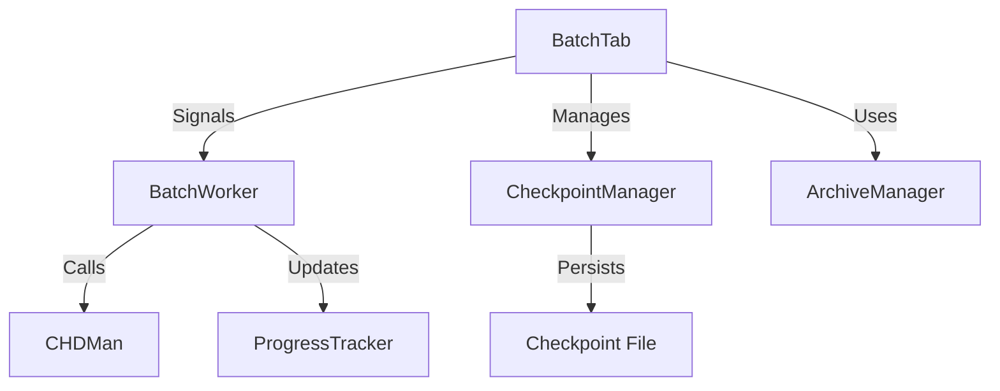

# RetroClamp Batch Processing Module Reference

## Table of Contents
- [Overview](#overview)
- [Architecture](#architecture)
- [Core Components](#core-components)
- [Usage Guide](#usage-guide)
- [Error Handling](#error-handling)
- [Performance Considerations](#performance-considerations)
- [Checkpoint System](#checkpoint-system)
- [Troubleshooting](#troubleshooting)
- [API Reference](#api-reference)

## Overview
The Batch Processing module provides a robust solution for processing multiple files through CHDMAN with features like:
- Drag-and-drop interface
- Pause/Resume functionality
- Error recovery and retry mechanisms
- Progress tracking
- Resource management

## Architecture



## Core Components

### 1. BatchTab (Main UI)
- Manages the user interface
- Handles file operations
- Coordinates worker threads
- Manages application state

### 2. BatchWorker (QThread)
- Processes files in background
- Emits progress signals
- Handles errors and retries
- Manages subprocesses

### 3. CheckpointManager
- Saves processing state
- Handles resume functionality
- Manages checkpoint files

### 4. ProgressTracker
- Tracks progress across files
- Calculates ETA
- Handles progress reporting

## Usage Guide

### Basic Workflow
1. Add files using the "Add Files" button or drag-and-drop
2. Configure processing options
3. Click "Start" to begin processing
4. Use Pause/Resume as needed
5. View progress in the table and progress bar

### Keyboard Shortcuts
- `Ctrl+O`: Add files
- `Ctrl+Enter`: Start/Pause processing
- `Ctrl+.`: Abort processing
- `Delete`: Remove selected files
- `Ctrl+A`: Select all files

## Error Handling

### Error Types
1. **File Errors**
   - Missing files
   - Permission issues
   - Corrupt archives

2. **Processing Errors**
   - CHDMAN failures
   - Invalid input files
   - Output path issues

3. **System Errors**
   - Out of disk space
   - Memory issues
   - Process termination

### Recovery Strategies
- Automatic retries with backoff
- Skip problematic files
- Save error log
- Resume from last good state

## Performance Considerations

### Resource Management
- Adjusts thread count based on CPU cores
- Monitors memory usage
- Cleans up temporary files
- Implements I/O throttling

### Optimization Tips
1. Process large files individually
2. Use faster compression for large batches
3. Store output on a different drive than input
4. Close other disk-intensive applications

## Checkpoint System

### File Format
```json
{
  "version": 1,
  "metadata": {
    "timestamp": "2025-05-16T12:00:00Z",
    "total_files": 100,
    "processed_files": 42
  },
  "files": [
    {
      "input": "/path/to/file1.iso",
      "output": "/output/path/file1.chd",
      "status": "completed",
      "error": null
    }
  ]
}
```

### Recovery Process
1. Load checkpoint file on startup
2. Verify file integrity
3. Resume from last processed file
4. Skip already processed files

## Troubleshooting

### Common Issues
1. **Process Stalls**
   - Check for large files
   - Verify disk space
   - Check system resources

2. **Permission Errors**
   - Run as administrator if needed
   - Check file permissions
   - Verify output path is writable

3. **Corrupt Output**
   - Verify input file integrity
   - Try different compression settings
   - Check for disk errors

### Logging
- Detailed logs in `~/.retroclamp/logs/`
- Enable debug logging for troubleshooting
- Logs include timestamps and thread information

## API Reference

### BatchTab
```python
class BatchTab(QWidget):
    """Main batch processing interface for RetroClamp.

    Provides a user interface for managing batch processing tasks, including
    file management, progress tracking, and process control.
    """

    # Signals
    processing_started = pyqtSignal()
    processing_paused = pyqtSignal()
    processing_resumed = pyqtSignal()
    processing_stopped = pyqtSignal()
    progress_updated = pyqtSignal(int, str)  # progress_percent, status
    file_completed = pyqtSignal(str, str)    # file_path, status
    error_occurred = pyqtSignal(str)         # error_message

    def __init__(self, parent=None):
        """Initialize the BatchTab with default settings.

        Args:
            parent: Parent widget (optional)
        """
        super().__init__(parent)
        self.files = []
        self.output_dirs = {}
        self.is_processing = False
        self.is_paused = False
        self.current_file_index = 0
        self.worker = None
        self.checkpoint_manager = CheckpointManager()
        self._setup_ui()

    def add_files(self, file_paths: List[str], output_dir: str = None) -> None:
        """Add files to the processing queue.

        Args:
            file_paths: List of file paths to add
            output_dir: Output directory for processed files (optional)
        """
        for file_path in file_paths:
            if file_path not in self.files:
                self.files.append(file_path)
                self.output_dirs[file_path] = output_dir or os.path.dirname(file_path)
        self._update_file_list()

    def start_processing(self) -> None:
        """Start or resume batch processing."""
        if not self.files:
            self.error_occurred.emit("No files to process")
            return

        if not self.is_processing:
            self.is_processing = True
            self.processing_started.emit()
            self._process_next_file()

    def pause_processing(self) -> None:
        """Pause the current processing."""
        if self.is_processing and not self.is_paused:
            self.is_paused = True
            if self.worker:
                self.worker.pause()
            self.processing_paused.emit()

    def resume_processing(self) -> None:
        """Resume paused processing."""
        if self.is_processing and self.is_paused:
            self.is_paused = False
            if self.worker:
                self.worker.resume()
            self.processing_resumed.emit()

    def abort_processing(self) -> None:
        """Stop processing and clear the queue."""
        if self.worker:
            self.worker.stop()
        self._cleanup()
        self.processing_stopped.emit()

    def save_state(self) -> bool:
        """Save current processing state to a checkpoint.

        Returns:
            bool: True if save was successful
        """
        state = {
            'files': self.files,
            'current_file_index': self.current_file_index,
            'output_dirs': self.output_dirs,
            'is_processing': self.is_processing,
            'is_paused': self.is_paused
        }
        return self.checkpoint_manager.save_checkpoint(state)

    def load_state(self) -> bool:
        """Load processing state from the latest checkpoint.

        Returns:
            bool: True if load was successful
        """
        state = self.checkpoint_manager.load_checkpoint()
        if state:
            self.files = state.get('files', [])
            self.current_file_index = state.get('current_file_index', 0)
            self.output_dirs = state.get('output_dirs', {})
            self._update_file_list()
            return True
        return False

    def _process_next_file(self) -> None:
        """Process the next file in the queue."""
        if self.current_file_index >= len(self.files):
            self._processing_complete()
            return

        current_file = self.files[self.current_file_index]
        output_dir = self.output_dirs.get(current_file, os.path.dirname(current_file))

        self.worker = BatchWorker(
            file_path=current_file,
            output_dir=output_dir,
            operation='compress',  # or get from UI
            row=self.current_file_index
        )

        self.worker.progress.connect(self._on_worker_progress)
        self.worker.finished.connect(self._on_worker_finished)
        self.worker.error.connect(self._on_worker_error)

        self.worker.start()

    def _on_worker_progress(self, progress: int, message: str) -> None:
        """Handle progress updates from worker."""
        self.progress_updated.emit(progress, message)

    def _on_worker_finished(self) -> None:
        """Handle worker completion."""
        self.file_completed.emit(
            self.files[self.current_file_index],
            "Completed successfully"
        )
        self.current_file_index += 1
        self._process_next_file()

    def _on_worker_error(self, error: str) -> None:
        """Handle worker errors."""
        self.error_occurred.emit(error)
        self.current_file_index += 1
        self._process_next_file()

    def _processing_complete(self) -> None:
        """Clean up after all processing is done."""
        self._cleanup()
        self.processing_stopped.emit()

    def _cleanup(self) -> None:
        """Clean up resources."""
        self.is_processing = False
        self.is_paused = False
        if self.worker:
            self.worker.deleteLater()
            self.worker = None

    def _setup_ui(self) -> None:
        """Set up the user interface."""
        # UI setup code would go here
        pass

    def _update_file_list(self) -> None:
        """Update the UI file list display."""
        # UI update code would go here
        pass
```

#### Usage Example
```python
# Create and set up the batch tab
batch_tab = BatchTab()

# Connect signals
batch_tab.processing_started.connect(lambda: print("Processing started"))
batch_tab.file_completed.connect(lambda f, s: print(f"File completed: {f} - {s}"))
batch_tab.error_occurred.connect(lambda e: print(f"Error: {e}"))

# Add files to process
batch_tab.add_files(["file1.iso", "file2.iso"], "/output/directory")

# Start processing
batch_tab.start_processing()

# Pause/resume processing
# batch_tab.pause_processing()
# batch_tab.resume_processing()

# Save/load state
# batch_tab.save_state()
# batch_tab.load_state()

# Abort processing
# batch_tab.abort_processing()
```

#### Signals
- `processing_started()`: Emitted when processing begins
- `processing_paused()`: Emitted when processing is paused
- `processing_resumed()`: Emitted when processing is resumed
- `processing_stopped()`: Emitted when processing completes or is aborted
- `progress_updated(percent, status)`: Emitted with progress updates
- `file_completed(file_path, status)`: Emitted when a file is processed
- `error_occurred(message)`: Emitted when an error occurs

#### Key Methods
- `add_files(file_paths, output_dir)`: Add files to process
- `start_processing()`: Start or resume processing
- `pause_processing()`: Pause processing
- `resume_processing()`: Resume paused processing
- `abort_processing()`: Stop processing and clear queue
- `save_state()`: Save current state to a checkpoint
- `load_state()`: Load state from a checkpoint
```

### BatchWorker
```python
class BatchWorker(QThread):
    """Background worker for processing files with CHDMAN.

    Handles file processing in a separate thread to maintain UI responsiveness.
    Supports both compression and extraction operations with progress tracking.
    """
    # Signals
    progress = pyqtSignal(int, str)      # progress_percent (0-100), status_message
    error = pyqtSignal(str, str)         # error_message, file_path
    finished = pyqtSignal()               # Emitted when processing completes successfully
    file_completed = pyqtSignal(str, str) # file_path, status_message

    def __init__(self, file_path: str, output_dir: str, operation: str, row: int):
        """Initialize the BatchWorker.

        Args:
            file_path: Path to the file to process
            output_dir: Output directory for processed files
            operation: Either 'compress' or 'extract'
            row: Row index in the file table for progress updates
        """
        super().__init__()
        self.file_path = file_path
        self.output_dir = output_dir
        self.operation = operation
        self.row = row
        self._is_running = True

    def run(self) -> None:
        """Main processing loop.

        Handles the actual file processing in a separate thread.
        Emits progress updates and handles errors.
        """
        try:
            # Processing logic here
            self.progress.emit(0, f"Starting {self.operation}...")

            # Example processing steps:
            # 1. Validate input
            # 2. Set up output paths
            # 3. Execute CHDMAN command
            # 4. Handle results

            self.progress.emit(100, f"Completed {self.operation}")
            self.file_completed.emit(self.file_path, f"{self.operation.capitalize()}ed successfully")
            self.finished.emit()

        except Exception as e:
            self.error.emit(str(e), self.file_path)

    def stop(self) -> None:
        """Stop processing gracefully.

        Sets a flag that will be checked during processing
        to allow for clean termination.
        """
        self._is_running = False
        self.progress.emit(0, "Stopping...")
```

#### Usage Example
```python
# Create worker instance
worker = BatchWorker(
    file_path="/path/to/input/file.iso",
    output_dir="/output/directory",
    operation="compress",
    row=0
)

# Connect signals
worker.progress.connect(update_progress_ui)
worker.error.connect(handle_error)
worker.finished.connect(processing_complete)
worker.file_completed.connect(update_file_status)

# Start processing
worker.start()

# To stop processing
worker.stop()
```

#### Signals
- `progress(percent: int, message: str)`: Emitted during processing with progress updates
- `error(message: str, file_path: str)`: Emitted when an error occurs
- `finished()`: Emitted when processing completes successfully
- `file_completed(file_path: str, status: str)`: Emitted when a file is processed

#### Methods
- `__init__(file_path, output_dir, operation, row)`: Initialize with processing parameters
- `run()`: Main processing method (runs in separate thread)
- `stop()`: Gracefully stop processing

### CheckpointManager
```python
class CheckpointManager:
    """Manages saving and loading of batch processing checkpoints.

    Handles serialization of the processing state to disk and provides
    methods to restore the state, allowing for process resumption.
    """

    def __init__(self, checkpoint_dir: str = None):
        """Initialize with optional custom checkpoint directory.

        Args:
            checkpoint_dir: Directory to store checkpoint files.
                          Defaults to user's app data directory.
        """
        self.checkpoint_dir = checkpoint_dir or self._get_default_checkpoint_dir()
        os.makedirs(self.checkpoint_dir, exist_ok=True)

    def save_checkpoint(self, state: dict, checkpoint_name: str = "latest") -> bool:
        """Save current processing state to a checkpoint file.

        Args:
            state: Dictionary containing processing state
            checkpoint_name: Name for the checkpoint (default: 'latest')

        Returns:
            bool: True if save was successful, False otherwise
        """
        try:
            checkpoint_path = os.path.join(
                self.checkpoint_dir,
                f"{checkpoint_name}.json"
            )

            # Add metadata
            state['_metadata'] = {
                'version': '1.0',
                'timestamp': datetime.datetime.utcnow().isoformat(),
                'checkpoint_name': checkpoint_name
            }

            # Save to file atomically
            temp_path = f"{checkpoint_path}.tmp"
            with open(temp_path, 'w', encoding='utf-8') as f:
                json.dump(state, f, indent=2)

            # On Windows, we need to remove the destination first if it exists
            if os.path.exists(checkpoint_path):
                os.remove(checkpoint_path)

            os.rename(temp_path, checkpoint_path)
            return True

        except Exception as e:
            logging.error(f"Failed to save checkpoint: {e}")
            return False

    def load_checkpoint(self, checkpoint_name: str = "latest") -> Optional[dict]:
        """Load saved processing state from a checkpoint file.

        Args:
            checkpoint_name: Name of the checkpoint to load (default: 'latest')

        Returns:
            dict: The saved state, or None if loading failed
        """
        try:
            checkpoint_path = os.path.join(
                self.checkpoint_dir,
                f"{checkpoint_name}.json"
            )

            if not os.path.exists(checkpoint_path):
                return None

            with open(checkpoint_path, 'r', encoding='utf-8') as f:
                return json.load(f)

        except Exception as e:
            logging.error(f"Failed to load checkpoint: {e}")
            return None

    def list_checkpoints(self) -> List[Dict[str, Any]]:
        """List all available checkpoints with their metadata.

        Returns:
            List of dictionaries containing checkpoint metadata
        """
        checkpoints = []
        for filename in os.listdir(self.checkpoint_dir):
            if filename.endswith('.json'):
                try:
                    with open(os.path.join(self.checkpoint_dir, filename), 'r') as f:
                        data = json.load(f)
                        if '_metadata' in data:
                            checkpoints.append(data['_metadata'])
                except:
                    continue
        return checkpoints

    def _get_default_checkpoint_dir(self) -> str:
        """Get the default directory for storing checkpoints."""
        app_name = "RetroClamp"
        if os.name == 'nt':  # Windows
            return os.path.join(os.environ.get('APPDATA'), app_name, 'checkpoints')
        else:  # Unix-like
            return os.path.expanduser(f"~/.config/{app_name}/checkpoints")
```

#### Checkpoint File Format
```json
{
  "_metadata": {
    "version": "1.0",
    "timestamp": "2025-05-16T17:00:00.000000",
    "checkpoint_name": "latest"
  },
  "files": [
    {
      "path": "/path/to/file1.iso",
      "status": "completed",
      "output_path": "/output/path/file1.chd"
    },
    {
      "path": "/path/to/file2.iso",
      "status": "pending",
      "output_path": "/output/path/file2.chd"
    }
  ],
  "settings": {
    "compression_level": 5,
    "operation": "compress"
  },
  "stats": {
    "total_files": 10,
    "processed_files": 5,
    "failed_files": 1,
    "start_time": "2025-05-16T16:30:00.000000"
  }
}
```

#### Usage Example
```python
# Initialize checkpoint manager
checkpoint_manager = CheckpointManager()

# Save current state
state = {
    'files': [
        {'path': 'file1.iso', 'status': 'completed'},
        {'path': 'file2.iso', 'status': 'pending'}
    ],
    'settings': {'compression_level': 5},
    'stats': {'total_files': 2, 'processed_files': 1}
}
checkpoint_manager.save_checkpoint(state, 'backup_1')

# Load saved state
saved_state = checkpoint_manager.load_checkpoint('backup_1')
if saved_state:
    print(f"Loaded checkpoint with {len(saved_state.get('files', []))} files")

# List all checkpoints
for checkpoint in checkpoint_manager.list_checkpoints():
    print(f"{checkpoint['checkpoint_name']} - {checkpoint['timestamp']}")
```

#### Methods
- `__init__(checkpoint_dir=None)`: Initialize with optional custom directory
- `save_checkpoint(state, checkpoint_name)`: Save processing state
- `load_checkpoint(checkpoint_name)`: Load saved state
- `list_checkpoints()`: List all available checkpoints
- `_get_default_checkpoint_dir()`: Get platform-specific default directory

    def clear_checkpoint(self) -> bool:
        """Remove checkpoint file."""
        pass
```

---
*Last Updated: 2025-05-16*
